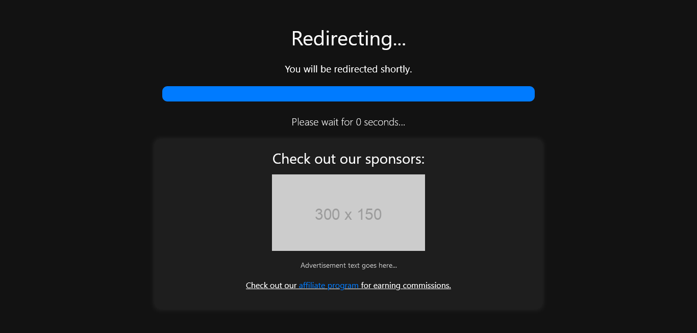

# HTML URL Redirecting Page

This repository contains a simple HTML page for redirecting users from one website to another. It includes security enhancements and various monetization methods.

## Description

The Redirect Page is a lightweight HTML page designed to redirect users from one URL to another after a specified duration. It includes security features such as Content Security Policy (CSP), secure HTTP headers, and input validation to mitigate common web vulnerabilities. Additionally, the page demonstrates several monetization techniques, making it suitable for use in affiliate marketing and advertising campaigns.

## Usage

To use the Redirect Page, simply host the HTML file on a web server and provide the destination URL as a parameter in the URL query string. The parameter name should be `b`, and the value should be the URL to which you want to redirect the user.

## Example URL
1. https://yourwebsite.com/go.html?b=https://destinationwebsite.com

2. /go.html?b=YOURURL

## Security Features

- Content Security Policy (CSP) with nonces
- Secure HTTP headers (X-Content-Type-Options, X-Frame-Options, X-XSS-Protection)
- Input validation to prevent injection attacks

## Monetization Methods

- Affiliate marketing: Include affiliate links or promotional content in the ad container.
- Sponsored content: Display sponsored ads or content within the ad container.

## License

This project is licensed under the MIT License - see the [LICENSE](LICENSE) file for details.
